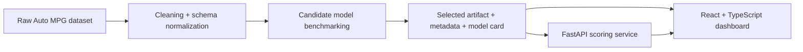

# Architecture Overview

## System flow

## Design notes

- Training is leak-free: all preprocessing happens inside sklearn pipelines and is fit only within cross-validation folds and the training split.
- The API serves the persisted artifact rather than rebuilding preprocessing at request time.
- The frontend consumes model metadata produced during training, which keeps form ranges, evaluation metrics, and feature importance synchronized with the deployed artifact.
- Docker images build the backend and frontend independently, making the project straightforward to demo or deploy behind a reverse proxy.
